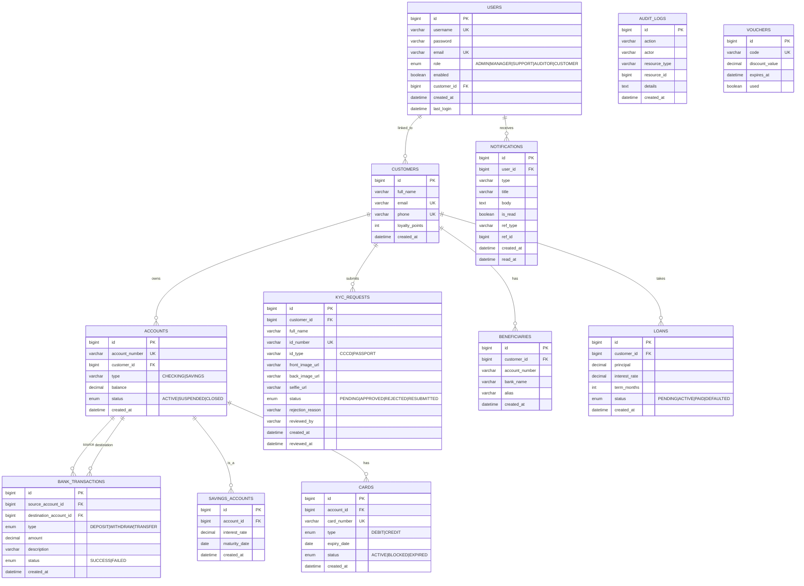

# Database Design Document
## Mini Banking System — Oct 2025

---

## 1. Overview

- **DBMS**: MySQL 8.0
- **Charset**: utf8mb4 / utf8mb4_unicode_ci
- **Schema**: `bank_system`
- **Migration tool**: Flyway (V1 – V11)
- **Total tables**: 14

---

## 2. Entity Relationship Diagram

---

## 3. Table Descriptions

### `users`
Authentication and authorization entity.

| Column | Type | Constraints | Description |
|---|---|---|---|
| id | BIGINT | PK, AUTO_INCREMENT | |
| username | VARCHAR(50) | UNIQUE, NOT NULL | Login identifier |
| password | VARCHAR(255) | NOT NULL | BCrypt encoded |
| email | VARCHAR(160) | UNIQUE, NOT NULL | |
| role | ENUM | NOT NULL | ADMIN, MANAGER, SUPPORT, AUDITOR, CUSTOMER |
| enabled | BOOLEAN | NOT NULL, DEFAULT TRUE | Soft disable |
| customer_id | BIGINT | FK → customers | NULL for non-customer roles |
| created_at | DATETIME | NOT NULL | |
| last_login | DATETIME | | |

**Indexes**: `idx_users_username`, `idx_users_email`

---

### `customers`
Customer profile linked to user account.

| Column | Type | Constraints | Description |
|---|---|---|---|
| id | BIGINT | PK | |
| full_name | VARCHAR(120) | NOT NULL | |
| email | VARCHAR(160) | UNIQUE, NOT NULL | |
| phone | VARCHAR(30) | UNIQUE, NOT NULL | |
| loyalty_points | INT | DEFAULT 0 | Gamification |
| created_at | DATETIME | NOT NULL | |

---

### `accounts`
Bank accounts owned by customers.

| Column | Type | Constraints | Description |
|---|---|---|---|
| id | BIGINT | PK | |
| account_number | VARCHAR(20) | UNIQUE, NOT NULL | System-generated |
| customer_id | BIGINT | FK → customers | |
| type | VARCHAR(20) | | CHECKING, SAVINGS |
| balance | DECIMAL(19,4) | DEFAULT 0 | Always ≥ 0 |
| status | VARCHAR(20) | | ACTIVE, SUSPENDED, CLOSED |
| created_at | DATETIME | | |

**Indexes**: `idx_accounts_customer_id`, `idx_accounts_account_number`

---

### `bank_transactions`
Immutable record of all financial movements.

| Column | Type | Constraints | Description |
|---|---|---|---|
| id | BIGINT | PK | |
| source_account_id | BIGINT | FK → accounts | NULL for deposits |
| destination_account_id | BIGINT | FK → accounts | NULL for withdrawals |
| type | ENUM | NOT NULL | DEPOSIT, WITHDRAW, TRANSFER |
| amount | DECIMAL(19,4) | NOT NULL | |
| description | VARCHAR(255) | | |
| status | ENUM | DEFAULT SUCCESS | SUCCESS, FAILED |
| created_at | DATETIME | NOT NULL | |

**Indexes**: `idx_txn_source`, `idx_txn_destination`, `idx_txn_created_at`

---

### `kyc_requests`
KYC identity verification workflow records.

| Column | Type | Constraints | Description |
|---|---|---|---|
| id | BIGINT | PK | |
| customer_id | BIGINT | FK → customers | |
| full_name | VARCHAR(120) | NOT NULL | |
| id_number | VARCHAR(30) | NOT NULL | CCCD / Passport number |
| id_type | VARCHAR(20) | CHECK | CCCD or PASSPORT |
| front_image_url | VARCHAR(500) | | Cloudinary URL |
| back_image_url | VARCHAR(500) | | Cloudinary URL |
| selfie_url | VARCHAR(500) | | Cloudinary URL |
| status | VARCHAR(20) | NOT NULL | PENDING, APPROVED, REJECTED, RESUBMITTED |
| rejection_reason | VARCHAR(500) | | Populated when REJECTED |
| reviewed_by | VARCHAR(50) | | Staff username |
| created_at | DATETIME | NOT NULL | |
| reviewed_at | DATETIME | | |

**Indexes**: `idx_kyc_customer`, `idx_kyc_status`

---

### `notifications`
Persistent notifications pushed via WebSocket.

| Column | Type | Constraints | Description |
|---|---|---|---|
| id | BIGINT | PK | |
| user_id | BIGINT | FK → users | |
| type | VARCHAR(30) | | CREDIT, DEBIT, KYC, SYSTEM |
| title | VARCHAR(200) | | |
| body | TEXT | | |
| is_read | BOOLEAN | DEFAULT FALSE | |
| ref_type | VARCHAR(50) | | transactions, kyc_requests |
| ref_id | BIGINT | | ID of related record |
| created_at | DATETIME | | |
| read_at | DATETIME | | |

**Indexes**: `idx_notif_user_id`, `idx_notif_is_read`

---

## 4. Key Design Decisions

| Decision | Rationale |
|---|---|
| DECIMAL(19,4) for money | Avoid floating-point precision errors |
| Immutable transactions | Financial audit requires never deleting/editing transactions |
| Flyway versioned migrations | Reproducible schema across dev/staging/prod |
| Soft deletes via `status`/`enabled` | Preserve referential integrity and audit history |
| FK with ON DELETE CASCADE on kyc_requests | KYC records removed when customer is deleted |
| Account lock ordering in transfer | Prevents deadlocks in concurrent transfer scenarios |

---

## 5. Schema Version History

| Migration | Description |
|---|---|
| V1 | Initial banking schema (customers, accounts, transactions) |
| V2 | Seed demo data |
| V3 | User authentication (users table, BCrypt passwords) |
| V4 | Audit log table |
| V5 | Beneficiaries and notifications |
| V6 | Multi-role seed data |
| V7 | Gamification, loyalty points, language lessons |
| V8 | Expanded seed data |
| V9 | Savings accounts, loans, cards |
| V10 | Support tickets |
| V11 | **KYC requests table** (current) |
